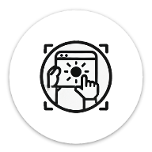

# SlideCapture.js
[SlideCapture.js](https://tetsuakibaba.github.io/SlideCapture.js/) は [SlideCapture](https://github.com/TetsuakiBaba/SlideCapture)をもっと手軽に実現することを目的としたアプリケーションです。

従来のSlideCaptureではOpenframeworksを利用していたため、メンテナンスや拡張が難しいという問題がありました。SlideCapture.jsはWeb技術を利用しているため、簡単に拡張やカスタマイズが可能です。ブラウザだけで動作するので非常に手軽に利用することができます。

## How to use
https://github.com/user-attachments/assets/25a954b4-42a9-4504-b968-f088caad4b53

Photo by Mikael Blomkvist: https://www.pexels.com/ja-jp/photo/6476776/

利用には主に3つの方法があります。

### HDMIダミープラグを用いる方法（Windows, macOS, Linux対応）、もっとも荷物が少ない方法
1. ウェブカメラ、HDMIダミープラグ、PCを持って学会会場へ
2. HDMIダミープラグをPCに接続し、拡張ディスプレイとして設定
3. [SlideCapture.js](https://tetsuakibaba.github.io/SlideCapture.js/)にアクセス
4. Open Fullscreen UI windowを開き、screen displayボタンからHDMIダミープラグディスプレイをプレビュー表示する
5. SlideCaptureのブラウザ画面をHDMIダミープラグディスプレイに移動して、全画面表示に切り替える（スライドがダミープラグに画面いっぱいに表示される）
6. ZOOM等でダミープラグの画面を共有する

### 外部ディスプレイとWebカメラを用いる方法（Windows, macOS, Linux対応）
1. ウェブカメラと適当な外付けモバイルディスプレイ、PCを持って学会会場へ
2. 会場の前の方に座り、マイクとモバイルディスプレイの接続を行う
3. [SlideCapture.js](https://tetsuakibaba.github.io/SlideCapture.js/)にアクセス、ウィンドウをモバイルディスプレイに移動しておく。
4. ウェブカメラで取得したスライドの四隅を指定して、全画面表示に切り替える（スライドがモバイルディスプレイに画面いっぱいに表示される）
5. ZOOM等で外付けディスプレイの画面を共有する。

### iPadだけを用いる方法（ macOSのみ）
1. iPadとMacを持って学会会場へ
2. iPadで[SlideCapture.js](https://tetsuakibaba.github.io/SlideCapture.js/)にアクセスし、発表スライドの四隅を指定し、全画面表示にする
3. MacでQuickTime PlayerやZOOM等でiPadの画面を共有する

